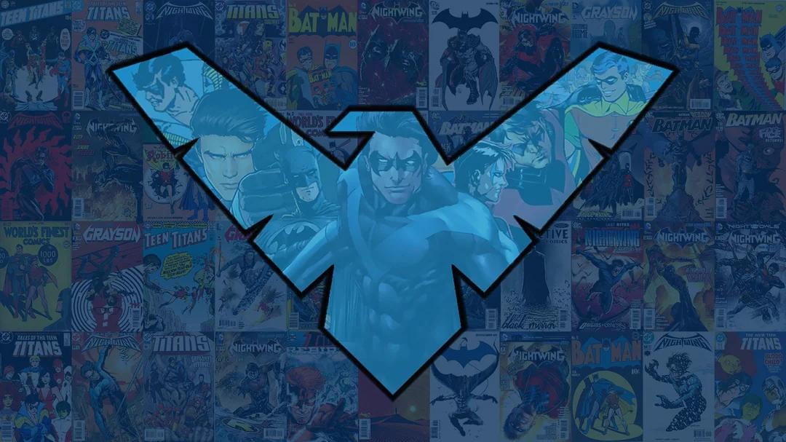

  

<h3 align="center"><code>courage-code-conquer</code></h3>

  
  &nbsp;&nbsp;&nbsp;
  
  &nbsp;&nbsp;&nbsp;
  

### `~$ functions()`

I save Blüdhaven by the day and code by the night

### `~$ ls ~/gadgets`

- [Visor](https://github.com/RohanOnKeys/Visor) - DOM-to-agent context compiler for browser agents.
- [North-Star](https://github.com/RohanOnKeys/North-Star) - test bed for orbital data streaming
- Batman's toys, a pair of electrically charged Escrima sticks, retractable grappling guns, wing-gliders and smoke or flash pellets.

### `~$ cat ~/next`

- interactive agent frontend
- self orchestrating hardware
- low level systems
- fighting crime

### `~$ git remote -v`

[Rohax.in](https://rohax.in)
